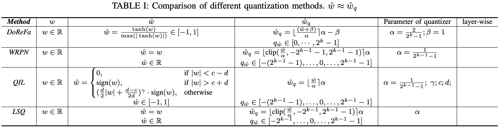

Introduction
============

不完全总结最近的量化工作

根据以往的工作，可以将量化部分划分为三个参数空间

1. 训练的参数空间 :math:`w \in \mathbb{R}`
2. 待量化的参数空间 :math:`\hat w \in \mathbb{R}`
3. 量化后的离散空间 :math:`q_w \in \mathbb{Z}`; :math:`w_q = \alpha (q_w - \beta)`

