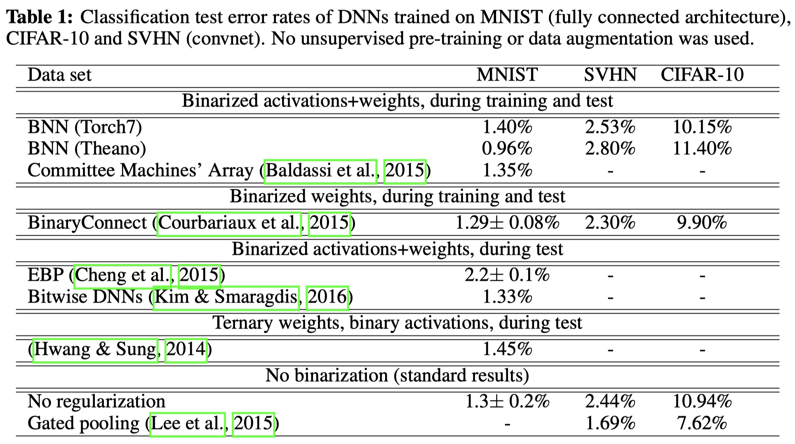

# BNN

Binarized Neural Networks **NIPS2016**

$$
\hat{w}_q = \mbox{sign}(\hat{w})
$$

Experiments

Reference:

[1] Binaryconnect: Training deep neural networks with binary weights during propagations.