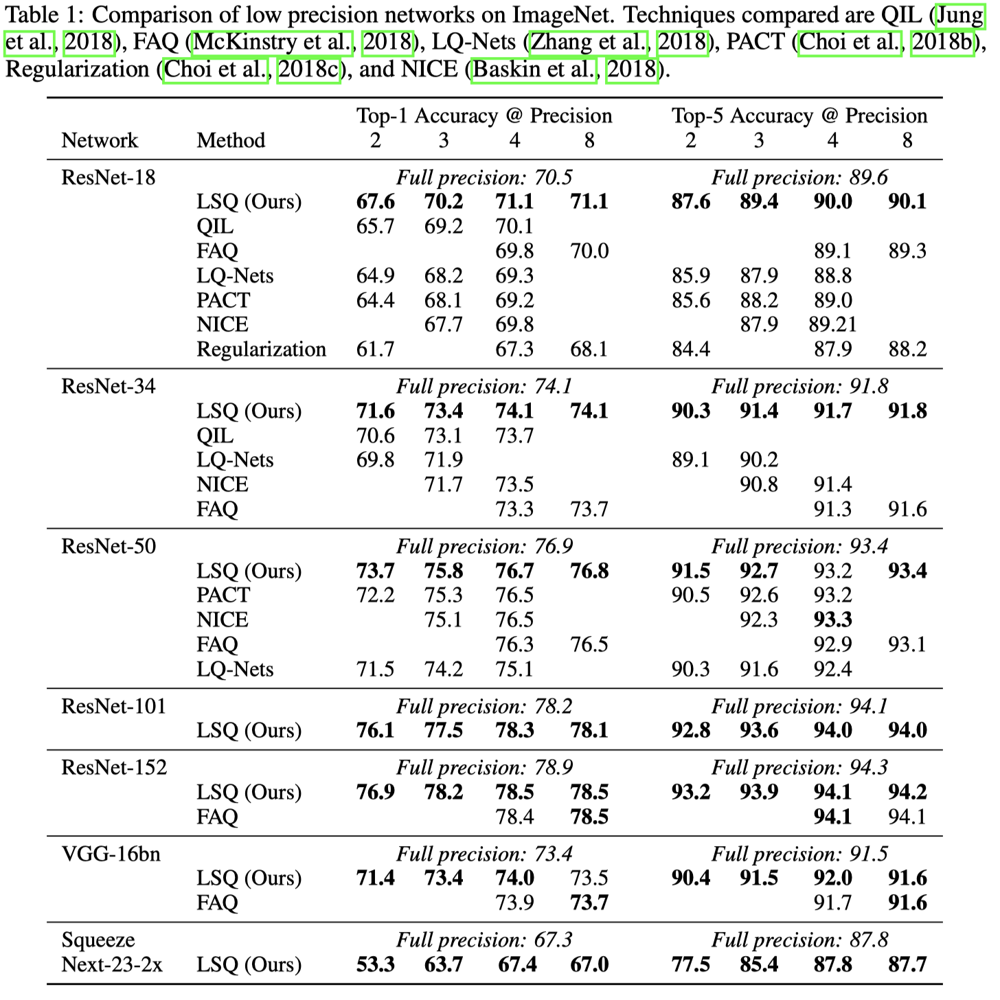

# LSQ

> Learned Step Size Quantization **ICLR 2019 open-review** [pdf](https://openreview.net/forum?id=rkgO66VKDS) 

1. The quantization function

For each layer of weights, LSQ quantize them as:

$$
    \hat{w}_q = \lfloor clip(\frac{\hat{w}}{\alpha}, -2^{k-1}, 2^{k-1}-1) \rceil
$$

For activations which _ActFun_ is ReLU:

$$
    \hat{a}_q = \lfloor clip(\frac{\hat{a}}{\alpha}, 0, 2^{k}-1) \rceil
$$

2. 训练更新`alpha`

优点：

1. 映射的方法十分的简单
2. 每层共享一个step size `alpha`

缺点：

1. BN层的运算为浮点运算，如果要进行BN fusion的话，也 `alpha` 的 layer-wise 属性有矛盾；基于此，我们可以对LSQ 进行改进。一种方法是直接在训练时就使用 channel-wise的 `alpha`，另一种方法是，仍然使用 layer-wise 的 `alpha`，但是在BN Fusion后，变为 channel-wise。这种方法理论上均可行，按照论文的实验结构，第二种方法实验基本可行，第一种方法需要额外的实验来验证。

