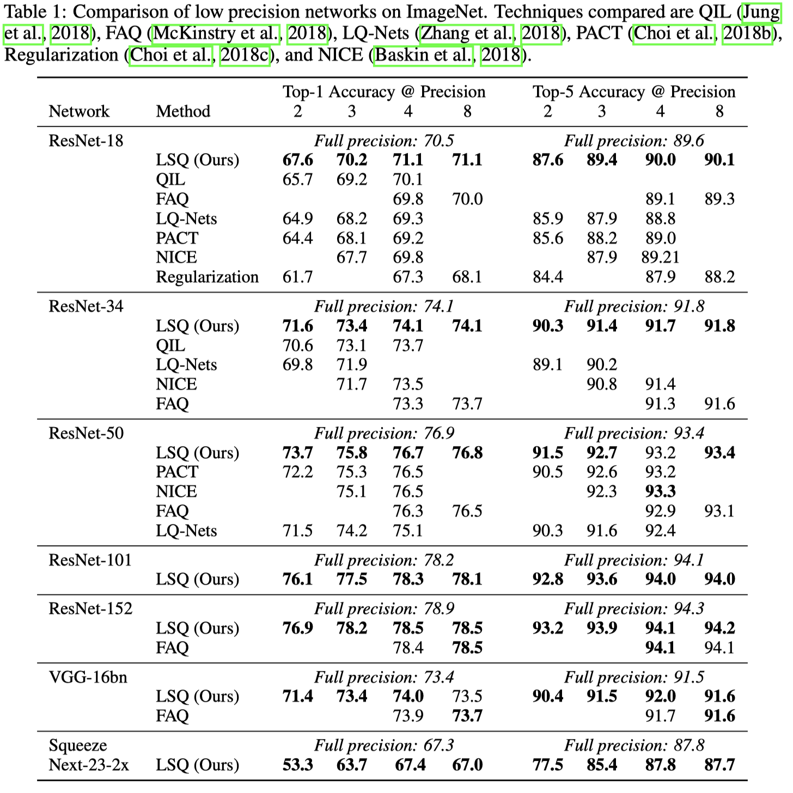

LSQ
====

> Learned Step Size Quantization

1. The quantization function

For each layer of weights or activations :math:`v`, LSQ quantize them as:

.. math::
	\bar{v} = \lfloor clip(v/s, -Q_N, Q_P) \rceil

