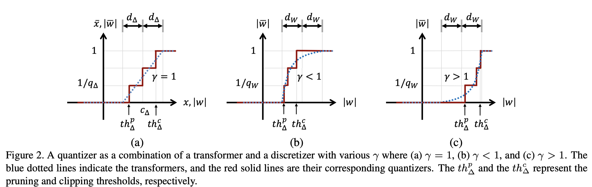
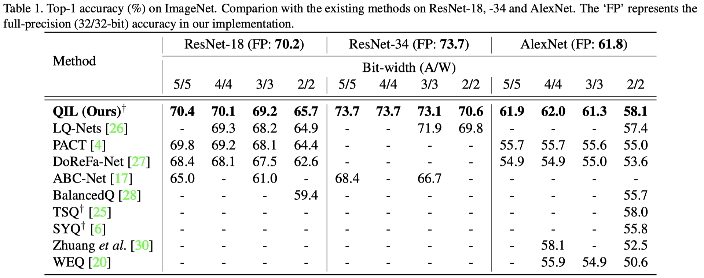
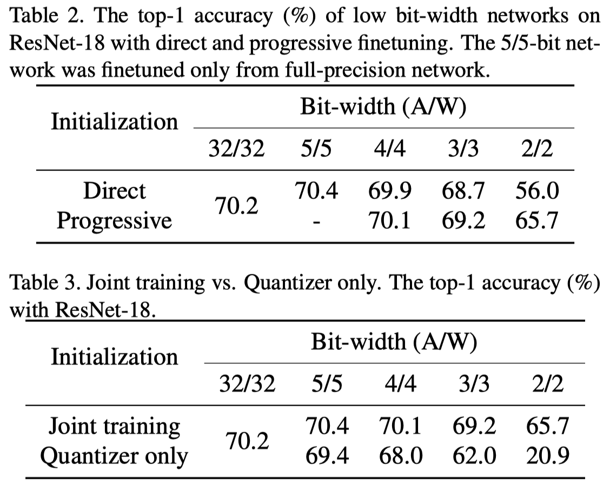

QIL
======

> Learning to Quantize Deep Networks by Optimizing Quantization Intervals with Task Loss

Quantization Functions:
************************

.. math::
    \hat w = \begin{cases} 
            0,  & \text{if } |w| < c_W - d_W \\
            \text{sign}(w),  & \text{if } |w| > c_W + d_W \\
            (\alpha_W |w| + \beta_W)^{\gamma} \cdot \text{sign}(w), & \text{otherwise}
            \end{cases}

where :math:`\alpha_W = 0.5/d_W` and :math:`\beta_W = -0.5c_W/d_W + 0.5`

.. math::
    \hat a = \begin{cases} 
            0,  & \text{if } a < c_A - d_A \\
            1,  & \text{if } a > c_A + d_A \\
            \alpha_A a + \beta_A, & \text{otherwise}
            \end{cases}

where :math:`\alpha_A = 0.5/d_A` and :math:`\beta_A = -0.5c_A/d_A + 0.5`

量化器的训练：
***************

1. 网络中的参数 :math:`\hat w`,按照BP算法进行梯度计算
2. :math:`\frac{\partial \hat w}{\partial \gamma}`
3. :math:`\frac{\partial \hat w}{\partial c_W}`
4. :math:`\frac{\partial \hat w}{\partial d_W}`

优点：

1. 虽然量化的过程复杂，但是在推理时，量化后的权重是固定的，仍可以表示为integer的方式

2. 有一个偏移的过程，可以起到剪枝的效果

缺点：

1. 真正参与到网络运算的权重，:math:`w\in [-1,1]`，并不能很好推广到除分类任务以外的任务

2. 激活值也是如此，:math:`a\in [0, 1]`

Experiments
***********

2/2给出的是Progressive finetuning的方法，LQ-Net是training from scratch，两者的相比性不大。

**Direct**: direct finetuning from full-precision weights. **Progressive finetuning**: (i.e, FP → 5/5 → 4/4 → 3/3 → 2/2 for 2/2-bit network)

**Joint Training**: The weights and quantization parameters are training jointly.
**Quantizer only**: Only optimize quantizers.

