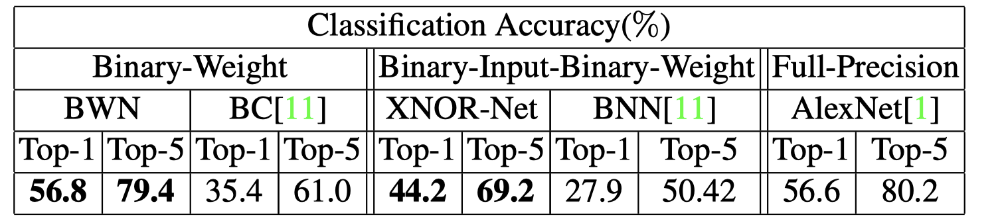

# XNOR-Net

> XNOR-Net: ImageNet Classification using binary convolutional neural networks. ECCV2016 
[pdf](https://arxiv.org/pdf/1603.05279.pdf) [code](http://allenai.org/plato/xnornet.)

$$
	w \in \mathbb{R}
$$

$$
	\hat{w} = w \in \mathbb{R}
$$

$$
	\hat{w}_q = \mbox{sign}(w)\alpha
$$

$$
	\alpha = \frac{1}{n}\||\hat{W}\||_{\ell_2}
$$

Experiment:

Reference:

[1] Binarynet: Training deep neural networks with weights and activations constrained to +1 or -1